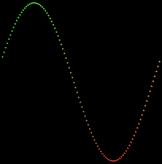

# UnityExperiences

This repo is the main place where I follow tutorials and make experimentations in Unity.

## Graph Building

This experimentation follows the tutorial [Building a Graph](https://catlikecoding.com/unity/tutorials/basics/building-a-graph/) from Catlike Coding. Here is the result :  

